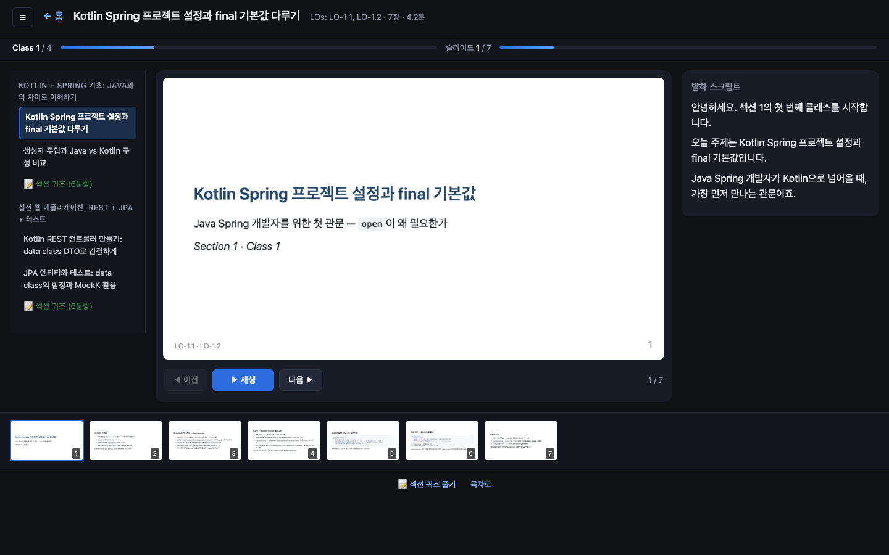
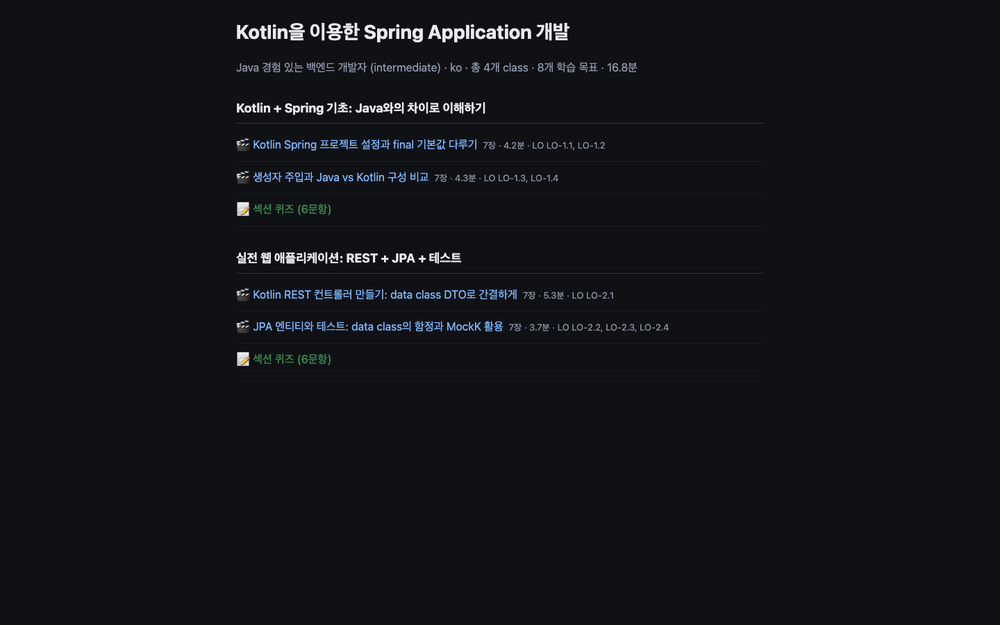

# AI Course Builder

> Multi-agent harness that turns a single topic into a complete online course — slides, lecture notes, TTS-ready transcripts, section quizzes, and a self-contained HTML player — grounded in classical instructional-design theory (ADDIE + Bloom's Taxonomy).

**From a prompt like `"Kotlin으로 Spring 애플리케이션 개발하기, 30분"`, this harness produces:**

- 📚 A structured **curriculum** (sections → classes → beats) with Bloom-tagged Learning Objectives
- 🎞 **Marp slides** per class, rendered to both HTML and 1920×1080 PNG sequences
- 📝 **Markdown study notes** (Intro → Concept → Example → Pitfalls → Recap)
- 🎧 **TTS-ready transcripts** with `[slide N]` cues and `[pause:ms]` markers
- 🔊 Synthesized **audio** (OpenAI `gpt-4o-mini-tts` with per-slide `speaker_affect` injection, or offline edge-tts)
- 📋 Auto-generated **section quizzes** (5-9 items, Bloom-balanced, plausible distractors, auto-grading)
- 🎬 A polished **HTML player** with course-level progress bar, TOC sidebar, end-of-class CTAs, and an interactive quiz UI
- 📦 Everything packaged as `bundle.zip` — open `index.html` and learners get the full experience

Everything is regenerated by a **single command**, after which you can `open course/index.html` and start learning.

---

## Table of Contents

- [Demo](#demo)
- [Why This Exists](#why-this-exists)
- [Architecture](#architecture)
- [Quick Start](#quick-start)
- [Deploy](#deploy)
- [Pipeline (5 Phases)](#pipeline-5-phases)
- [Output Structure](#output-structure)
- [Player UX](#player-ux)
- [Configuration](#configuration)
- [Agents & Skills](#agents--skills)
- [Key Design Choices](#key-design-choices)
- [Project Layout](#project-layout)
- [Extending the Harness](#extending-the-harness)
- [Phase 7: Harness Evolution](#phase-7-harness-evolution)
- [Roadmap](#roadmap)
- [License](#license)

---

## Demo



<details>
<summary>Course landing page (table of contents view)</summary>



</details>

Two sample courses have been produced end-to-end during development:

| Topic | Audience | Duration | Sections × Classes | Bundle |
|---|---|---|---|---|
| NotebookLM 활용법 | Intermediate developers | ~10 min audio | 1 × 2 | 13 MB |
| Kotlin을 이용한 Spring Application 개발 | Java devs, intermediate | ~17 min audio | 2 × 2 | 13 MB |

Generated artifacts (sample slide, note excerpt, quiz item):

<details>
<summary>Example: slide.source.md (Kotlin class intro)</summary>

```markdown
---
marp: true
theme: default
paginate: true
footer: "LO-1.2"
---

# Kotlin Spring 프로젝트 설정과 final 기본값

## 자바 개발자를 위한 첫 번째 허들

S1.C1 · 4.2분

---

## 미스터리 한 장면

- Java로 잘 돌던 @Configuration을 Kotlin으로 그대로 옮겼습니다
- @Bean이 싱글턴 캐시를 우회합니다
- DataSource가 요청마다 새로 생성되네요?
- 왜 Kotlin만 무너질까요?

---

## 왜 Kotlin만 무너질까 — final vs open

- Java의 기본 가시성은 `open` (상속 가능)
- Kotlin의 기본 가시성은 `final` (상속 불가)
- Spring의 `@Configuration`/`@Transactional`은 CGLIB **상속 기반 프록시**
- `final` 클래스에는 프록시가 안 붙습니다 — 그래서 기능이 조용히 사라짐
```
</details>

<details>
<summary>Example: quiz.json item (Bloom Analyze)</summary>

```json
{
  "id": "S1.Q5",
  "type": "mcq_multi",
  "stem": "다음 중 'Kotlin이 Java보다 무조건 낫다'는 주장을 반박하는 근거 2개를 고르시오.",
  "choices": [
    "Lombok이 없어도 data class로 동일한 기능을 더 간결하게 작성할 수 있다",
    "기존 사내 라이브러리가 Kotlin과 호환되지 않을 수 있고, 팀의 Kotlin 숙련도가 낮으면 학습 곡선 비용이 발생한다",
    "Kotlin 컴파일러가 non-null 타입 체크를 해주기 때문에 런타임 NPE가 줄어든다",
    "기존 IDE 디버거나 프로파일러의 Kotlin 지원이 Java 대비 미성숙한 영역이 남아있다",
    "주 생성자 문법으로 생성자 주입 보일러플레이트를 완전히 제거할 수 있다"
  ],
  "correct": ["B", "D"],
  "explanation": "Kotlin의 장점을 나열한 A/C/E와 달리, 현실에서 Kotlin 도입을 가로막는 제약은 (B) 생태계 호환성·팀 숙련도와 (D) 도구 체인 성숙도입니다. Analyze 레벨의 핵심은 트레이드오프의 양면을 모두 읽어내는 것.",
  "lo_ids": ["LO-1.4"],
  "bloom": "Analyze"
}
```
</details>

---

## Why This Exists

Most "AI course generators" on the market today output a single big document or slide deck and call it a day. They skip the hard parts:

1. **Pedagogical grounding** — no learning-objective scaffolding, no Bloom's Taxonomy balance, no cognitive-load-aware pacing.
2. **Multi-artifact consistency** — when the slide, note, transcript, and quiz are generated independently, they drift. The quiz tests LO-2.3 but the slide never introduced it.
3. **Production-grade output** — text blobs don't teach. A real course needs slides *and* audio *and* quizzes *and* a player that orchestrates them.
4. **Iterative refinement** — one-shot prompts produce averaged-out mush. Real course authors review, discover issues, and revise.

This project tackles all four:

1. **ADDIE + Bloom's Taxonomy** drive every agent. A shared, immutable **Learning Objective registry** is the north star — every slide, note, transcript, and quiz item cites LO ids.
2. A **cross-artifact `coherence-reviewer`** verifies LO coverage, Bloom balance, slide↔transcript cue alignment, note↔slide reference validity, quiz factual accuracy, and transcript speakability before build.
3. The final build emits a **self-contained HTML player** (slide image + audio + live captions + thumbnails + next-step CTAs + TOC sidebar + progress bar) plus an **interactive quiz** with auto-grading — open `index.html` and a learner has a complete experience.
4. The harness is designed as a **living system**: every real run surfaces issues, which are captured in `CLAUDE.md`'s change log and translated into skill/agent refinements. The harness that built the Kotlin course was already smarter than the one that built the NotebookLM course.

---

## Architecture

```
┌────────────────────────────────────────────────────────────────────────┐
│  ORCHESTRATOR  (.claude/skills/course-builder/SKILL.md)                │
│                                                                        │
│   topic, audience, depth, duration, language, tone                     │
│                        │                                               │
│                        ▼                                               │
│  ┌───────────────── Phase 1: Design ──────────────────────────────┐    │
│  │  curriculum-architect  ──┐                                     │    │
│  │         │                │ Course Spec + LO registry (JSON)    │    │
│  │         ▼                │                                     │    │
│  │  section-designer ✕ N ───┤ per-section class breakdown          │    │
│  │         │                │                                     │    │
│  │         ▼                │                                     │    │
│  │  class-planner ✕ M ──────┘ per-class beat sheet (hook/teach/    │    │
│  │                           example/practice/recap + affect)     │    │
│  └────────────────────────────────────────────────────────────────┘    │
│                        │                                               │
│                        ▼                                               │
│  ┌───────────────── Phase 2: Content ─────────────────────────────┐    │
│  │   For each class (fan-out, parallel):                          │    │
│  │                                                                │    │
│  │   slide-author  ∥  note-writer                                 │    │
│  │        │              │                                        │    │
│  │        └──────┬───────┘                                        │    │
│  │               ▼                                                │    │
│  │        script-writer  (needs slide numbers + beats)            │    │
│  └────────────────────────────────────────────────────────────────┘    │
│                        │                                               │
│                        ▼                                               │
│  ┌───────────────── Phase 3: Assessment ─────────────────────────┐     │
│  │  quiz-master (per section, 5-9 items, Bloom balance, LO       │     │
│  │  coverage, plausible distractors from note Pitfalls)          │     │
│  └───────────────────────────────────────────────────────────────┘     │
│                        │                                               │
│                        ▼                                               │
│  ┌───────────────── Phase 4: QA ─────────────────────────────────┐     │
│  │  coherence-reviewer (8-step fail-fast):                       │     │
│  │    1. Structural presence                                     │     │
│  │    2. LO coverage (slide + note + quiz)                       │     │
│  │    3. Bloom balance (course ≥ 4 levels, section ≥ 3)          │     │
│  │    4. Slide ↔ Script cue alignment                            │     │
│  │    5. Note ↔ Slide reference validity                         │     │
│  │    6. Tone consistency                                        │     │
│  │    7. Quiz factuality (vs slide + note)                       │     │
│  │    8. Transcript speakability                                 │     │
│  │                                                               │     │
│  │  If revise: routes fix-hints to originating agent via         │     │
│  │  SendMessage, up to 2 rounds per issue.                       │     │
│  └───────────────────────────────────────────────────────────────┘     │
│                        │                                               │
│                        ▼                                               │
│  ┌───────────────── Phase 5: Build (one-shot) ───────────────────┐     │
│  │  asset-builder runs build-bundle.sh:                          │     │
│  │    ① Marp render (HTML + 1920×1080 PNG per slide)             │     │
│  │    ② TTS synthesis (OpenAI default, edge-tts fallback,        │     │
│  │       audio cache aware)                                       │     │
│  │    ③ Manifest synthesis (synth-manifest.py)                    │     │
│  │    ④ HTML player + quiz + index generation                    │     │
│  │       (generate-player.py)                                    │     │
│  │    ⑤ SSML validation                                           │     │
│  │    ⑥ bundle.zip packaging                                     │     │
│  └───────────────────────────────────────────────────────────────┘     │
│                        │                                               │
│                        ▼                                               │
│                  course/build/bundle.zip                               │
│                  course/index.html    ← open this                      │
└────────────────────────────────────────────────────────────────────────┘
```

**Key invariant:** every agent reads from and writes to a shared `_workspace/` directory. The Learning Objective registry (`_workspace/01_architect_learning_objectives.json`) is the **single source of truth** — every downstream artifact cites LO ids from this registry, and LO ids are never renumbered once issued. This is what keeps 9 agents pulling in the same direction.

---

## Quick Start

### Prerequisites

| Tool | Purpose | Install |
|---|---|---|
| Python 3.10+ | All helper scripts | System Python or pyenv |
| [Marp CLI](https://marp.app/) | Slide rendering (HTML + PNG) | `npm install -g @marp-team/marp-cli` |
| ffmpeg | Audio silence + concat | `brew install ffmpeg` |
| `openai` Python SDK | OpenAI TTS engine | `pip install openai` |
| `jq` (optional) | Manifest inspection | `brew install jq` |
| `edge-tts` (optional) | Free fallback TTS | `pip install edge-tts` |
| `xmllint` (optional) | SSML validation | macOS built-in |
| Claude Code or similar | To run the agent orchestrator | See [Agent setup](#running-the-orchestrator) |

### Environment setup

```bash
git clone https://github.com/tobyilee/course-builder.git
cd course-builder

# 1. Install Python deps
pip install openai

# 2. Configure OpenAI API key
cp .env.example .env    # if .env.example is added later, else:
cat > .env <<'EOF'
export OPENAI_API_KEY=sk-proj-...your_key_here...
EOF

# 3. Verify tools
which marp ffmpeg
```

### Running the orchestrator

The orchestrator (`.claude/skills/course-builder/SKILL.md`) is designed to be invoked from [Claude Code](https://claude.com/claude-code) or any agent platform that loads `.claude/agents/` and `.claude/skills/`. From a fresh Claude Code session in this directory, simply say:

```
"Kotlin으로 Spring 애플리케이션 개발하기, 30분짜리 강의로 만들어줘"
```

Claude Code will:
1. Read `CLAUDE.md` (trigger rules)
2. Invoke the `course-builder` orchestrator skill
3. Spawn the 9 specialized agents in phases
4. Run `build-bundle.sh` as the final step

### Running the build step alone

If you already have workspace specs and just want to (re)build:

```bash
bash .claude/skills/asset-build/scripts/build-bundle.sh course
```

This re-renders slides, synthesizes missing audio, regenerates the player HTML, and repackages the bundle. It's idempotent — run it as often as you want; the smart caching only re-synthesizes TTS when `audio/full.mp3` is missing.

### Opening the result

```bash
open course/index.html           # course home (TOC)
open course/.../player.html      # individual class player
open course/.../quiz.html        # interactive quiz
```

---

## Deploy

`course/` is a self-contained static site (HTML + PNG + MP3, all relative paths). No server runtime required — drop it on any static host.

### Cloudflare Pages (one-line deploy)

```bash
# First-time auth (interactive, opens browser)
npx wrangler@latest login

# Deploy
scripts/deploy-cloudflare.sh                 # default project: course-builder
scripts/deploy-cloudflare.sh my-course       # custom project name
CF_PAGES_BRANCH=preview scripts/deploy-cloudflare.sh   # preview branch
```

The script:
- verifies `course/` is a built course (must contain `index.html` + `manifest.json`)
- temporarily moves `course/build/bundle.zip` aside so the build byproduct isn't published, then restores it via a shell `trap`
- invokes `npx wrangler pages deploy` against `--branch=main` so the upload lands on the production deployment, not a preview branch

**Custom domain.** Cloudflare dashboard → Pages → `<project>` → Custom domains → "Set up a custom domain" → e.g. `course.yourdomain.com`. CNAME and TLS are auto-provisioned if the domain already lives in your Cloudflare zone.

**Why Pages alone (no R2 / Workers / D1).** The whole course is ~80–100 MB of static assets per ~8-class course; Pages' 25 GB/deploy and 25 MB/file limits give two orders of magnitude of headroom. R2 for audio only becomes worthwhile when MP3 volume crosses a few GB or when egress savings start to matter.

---

## Pipeline (5 Phases)

### Phase 1 — Design (sequential with fan-out)

**`curriculum-architect`** (1 call)
- Input: `topic`, `audience`, `depth`, `duration`, `language`, `tone`
- Output: Course Spec + LO registry
- Key rules: every LO starts with a Bloom-verb ("설명한다", "비교한다", not "안다"); Remember+Understand should be ≤40% of total LOs for intermediate+ audiences; LO ids follow `LO-<sec>.<idx>` and are **never renumbered**.

**`section-designer`** (N parallel, one per section)
- Splits a section into 2-4 classes
- Assigns 1-2 LOs per class
- Encodes class dependency graph (linear or DAG)

**`class-planner`** (M parallel, one per class)
- Produces a **beat sheet** — the shared plan slide/note/script authors all read
- 5-beat structure: `hook → teach → example → practice → recap`
- Each beat carries `key_points`, `lo_ids`, `visual_hint`, `speaker_affect` (e.g., "호기심 유발", "차분", "흥분")

### Phase 2 — Content (parallel per class)

For each class, three artifacts are produced with tight coupling:

- **`slide-author`** → `slide.source.md` (Marp Markdown, 4-7 slides, ≤80 words each)
- **`note-writer`** → `note.md` (400-900 words, 5-part structure, cross-references to slides)
- **`script-writer`** → `transcript.txt` (speakable, `[slide N]` cues, `[pause:ms]` markers on their own lines, **one sentence per line** — required by the player's char-proportional subtitle-sync, since a whole-slide single-line transcript renders as one un-highlightable blob. Raw code literals forbidden — "const x = 1" becomes "상수 x에 1을 할당합니다")

The script-writer depends on the slide-author's output (needs slide numbers for cues), so the two content-side writers run in parallel and the script writer follows.

### Phase 3 — Assessment (parallel per section)

**`quiz-master`** generates a `quiz.json` per section:
- 5-9 items (never 10+ — protects against question fatigue)
- Bloom balance: Apply+Analyze ≥ 2 per section
- LO coverage: every section LO appears in ≥1 quiz item
- Mixed types: `mcq_single`, `mcq_multi`, `true_false`, `short_answer`
- **Plausible distractors** mined from the note's Pitfalls section — e.g., "ChatGPT vs NotebookLM 혼동", "data class 엔티티 equals 폭발"
- Every item carries `explanation` + `distractor_rationales`

### Phase 4 — QA (revise loop)

**`coherence-reviewer`** performs an **8-step fail-fast cross-artifact audit**:

| # | Check | Why it matters |
|---|---|---|
| 1 | Structural presence | All 4 artifacts per class + quiz per section exist |
| 2 | LO coverage | Every LO appears in ≥1 slide, ≥1 note, ≥1 quiz item |
| 3 | Bloom balance | Course ≥ 4 levels, section ≥ 3 levels, quiz Apply+Analyze ≥ 2 |
| 4 | Slide ↔ Script cue alignment | `[slide N]` cue count == slide count |
| 5 | Note ↔ Slide reference validity | Every `[slide K]` in note is within slide range |
| 6 | Tone consistency | Per-class friendly/formal/socratic tone is preserved |
| 7 | Quiz factuality | Correct answers don't contradict slide or note content |
| 8 | Transcript speakability | No backticks, no raw URLs, no 4+ digit numbers (excluding `[pause:N]`/`[slide N]` bracket-directives) |

If issues are found, the reviewer routes each to the responsible agent via `SendMessage` with a fix-hint. Revision loops are capped at 2 rounds per issue — beyond that, human-in-the-loop is requested.

### Phase 5 — Build (one-shot)

`asset-builder` runs `build-bundle.sh`, which executes the full asset pipeline:

```
build-bundle.sh course
  ├── ① Marp HTML + PNG render (per class, idempotent)
  ├── ② TTS synthesis (if OPENAI_API_KEY set and SKIP_TTS != 1)
  │     • scripts/synthesize-tts.py per class
  │     • Audio cache: skips class if audio/full.mp3 exists
  │     • Beats JSON enables per-slide speaker_affect overlay
  │     • OpenAI gpt-4o-mini-tts + nova + speed 1.3 + scaled pauses
  ├── ③ Manifest synthesis (synth-manifest.py)
  ├── ④ Player HTML generation (generate-player.py)
  │     • index.html (course home)
  │     • player.html per class (slide + audio + transcript + thumbs
  │       + progress bar + TOC sidebar + end-panel CTAs)
  │     • quiz.html per section (auto-grading + post-submit nav)
  ├── ⑤ SSML validation (warn only)
  └── ⑥ bundle.zip packaging
```

Environment overrides:

| Variable | Effect |
|---|---|
| `SKIP_TTS=1` | Skip TTS even if API key is present (text-only build) |
| `FORCE_TTS=1` | Re-synthesize TTS even if cached audio exists |
| `SKIP_PLAYER=1` | Skip HTML player generation (raw files only) |

---

## Output Structure

```
course/
├── manifest.json               ← course-wide meta, stats, asset index
├── index.html                  ← learner entry point (TOC + progress)
├── meta/
│   ├── audience.md             ← rendered audience profile
│   └── learning_objectives.json← LO registry (shared with all artifacts)
├── sections/
│   └── <NN-slug>/
│       ├── section.json
│       ├── quiz.json           ← 5-9 items
│       ├── quiz.html           ← interactive auto-grading UI
│       └── classes/
│           └── <NN-slug>/
│               ├── class.json
│               ├── slide.source.md    ← Marp source (authoritative)
│               ├── slide.html         ← rendered slide deck
│               ├── slides_png/        ← 1920×1080 PNGs per slide
│               ├── note.md            ← learner-facing deep read
│               ├── transcript.txt     ← TTS-ready speakable script
│               ├── transcript.ssml    ← (optional) SSML variant
│               ├── audio/
│               │   ├── slide_01.mp3   ← per-slide audio segments
│               │   ├── ...
│               │   └── full.mp3       ← concatenated class audio
│               └── player.html        ← self-contained player
└── build/
    └── bundle.zip              ← deployable package (entire course)

_workspace/                     ← intermediate specs (gitignored)
├── 01_architect_course_spec.json
├── 01_architect_learning_objectives.json
├── 02_section_<sid>.json
├── 03_class_<cid>_beats.json
├── 98_build_log.txt
└── 99_coherence_report.{json,md}
```

---

## Player UX

Each class's `player.html` is a self-contained page (no backend required). Open it in any modern browser:

```
┌─────────────────────────────────────────────────────────────┐
│ ☰ ← 홈  │  Kotlin Spring 프로젝트 설정... │ LOs · 7장 · 4.2분 │
├─────────────────────────────────────────────────────────────┤
│ Class 1/4 ████░░░░ 25%   슬라이드 3/7 ███░░░░░░             │
├─────────────┬──────────────────────────────┬────────────────┤
│ SECTION 1   │                              │ 발화 스크립트  │
│ ▌ 현재 클래스│                              │                │
│   다음 수업  │   [ slide 1920×1080 image ]  │ [ 현재 슬라이드│
│ 📝 섹션 퀴즈 │                              │   스크립트 ]   │
│             │                              │                │
│ SECTION 2   │   ◀ 이전  ▶ 재생  다음 ▶     │                │
│   수업       │   1 / 7                      │                │
│ 📝 섹션 퀴즈 │                              │                │
├─────────────┴──────────────────────────────┴────────────────┤
│  [ 썸네일 1 ] [ 썸네일 2 ] ... [ 썸네일 7 ]                  │
├─────────────────────────────────────────────────────────────┤
│              🎉 수업을 완료했어요!  (on last slide)          │
│           [ ▶ 다음 수업 ]      [ 📝 섹션 퀴즈 ]              │
└─────────────────────────────────────────────────────────────┘
```

**Features:**
- **Synchronized audio + slides** — per-slide MP3 plays alongside its PNG; auto-advances on audio end
- **Course-level progress bar** — "Class 2 / 4" + percent fill, updated across the whole curriculum
- **Slide-level progress bar** — "슬라이드 3 / 7" + fill
- **TOC sidebar** — all sections/classes/quizzes with the current class highlighted; clickable to jump
- **Responsive** — 3-column (TOC | stage | transcript) at ≥1280px, collapses to 2-column then 1-column
- **Keyboard shortcuts** — `space` (play/pause), `←`/`→` (prev/next slide)
- **End-of-class CTAs** — context-aware: next-class link or section-quiz link or course-complete, depending on position
- **Interactive quiz** — radio/checkbox UIs, auto-grading with color-coded correct/wrong, full explanation + distractor rationale revealed on submit
- **Post-quiz navigation** — next section's first class linked after submission
- **Dark theme** with gradient end-panel and `slideIn` animation

---

## Configuration

### CLI (`scripts/synthesize-tts.py`)

```
synthesize-tts.py <transcript.txt> <out_dir>
  [--engine openai|edge]      # default: openai
  [--model MODEL]             # openai: gpt-4o-mini-tts (default), tts-1, tts-1-hd
  [--voice VOICE]             # openai: nova (default), shimmer, coral, sage, ash, ...
                              # edge:   ko-KR-SunHiNeural (default)
  [--rate RATE]               # edge only; default +0%
  [--speed SPEED]             # openai only; default 1.3 (30% faster than natural)
  [--instructions TEXT]       # openai gpt-4o only; tone guidance
  [--beats PATH]              # optional; enables per-slide speaker_affect overlay
```

### Voice options (OpenAI)

| Voice | Character | Good for |
|---|---|---|
| `nova` (default) | Bright, clear female | Friendly tutorials |
| `shimmer` | Soft, warm female | Gentle explanations |
| `coral` | Warm, natural female | Conversational tone |
| `sage` | Calm, measured female | Academic lectures |
| `echo` / `onyx` / `ash` | Male options | Variety |

### Per-slide tone injection (`--beats`)

When a `beats.json` file is provided, the script maps each slide to a beat's `speaker_affect` and overlays it onto the base instructions. Example mapping for a 7-slide class:

| Slide | Beat | Affect | Effective instruction |
|---|---|---|---|
| 1 | (title) | — | base: "친근하고 명료한 한국어 개발자 튜토리얼 강사 톤..." |
| 2 | hook | 호기심 | base + "호기심을 자극하는 질문형 톤. 문장 끝을 살짝 올리고 기대감을 실어라." |
| 3 | teach | 차분, 명료 | base + "차분하고 또렷한 설명 톤. 안정된 호흡으로." |
| 5 | example | 흥분 섞인 설명 | base + "라이브 데모 같은 생동감 있는 톤. 에너지를 실어서." |
| 6 | practice | 질문하는 톤, 침묵 허용 | base + "질문하는 톤. 답을 유도하는 느낌으로." |
| 7 | recap | 힘 실린 확신 | base + "확신에 찬 정리 톤. 힘있게 마무리." |

17 affect keywords are recognized; see `AFFECT_OVERLAYS` in `synthesize-tts.py`.

---

## Agents & Skills

### 9 Agents (`.claude/agents/`)

| Agent | Role | Key output |
|---|---|---|
| `curriculum-architect` | Course-level ID; LO registry author | Course Spec + LOs |
| `section-designer` | Section → class breakdown | Class specs per section |
| `class-planner` | Beat sheet for a single class | `03_class_<cid>_beats.json` |
| `slide-author` | Marp Markdown (4-7 slides, ≤80 words) | `slide.source.md` |
| `note-writer` | 5-part Markdown note | `note.md` |
| `script-writer` | TTS-ready speakable transcript | `transcript.txt` |
| `quiz-master` | Section-level 5-9 item quiz | `quiz.json` |
| `coherence-reviewer` | 8-step cross-artifact QA | `99_coherence_report.{json,md}` |
| `asset-builder` | One-shot build orchestration | `bundle.zip` |

### 10 Skills (`.claude/skills/`)

| Skill | Used by | Provides |
|---|---|---|
| `course-builder` | Orchestrator (top-level) | 5-phase workflow + HITL checkpoints |
| `curriculum-design` | architect, designer | LO writing rules, Bloom mapping, section heuristics |
| `class-planning` | planner | 5-beat structure + duration allocation |
| `slide-authoring` | slide-author | Marp frontmatter + layout rules + `render-marp.sh` |
| `note-writing` | note-writer | 5-part template + cross-ref rules + tone guide |
| `script-writing` | script-writer | Speakability rules + voice rate table + `validate-ssml.sh` |
| `quiz-generation` | quiz-master | Bloom item templates + distractor patterns |
| `coherence-review` | reviewer | 8-step audit + issue-routing logic |
| `asset-build` | builder | `build-bundle.sh` + manifest schema |
| `tts-synthesis` | builder (delegated) | TTS API contract + retry + `run.sh` wrapper |

---

## Key Design Choices

### 1. LO registry is the single source of truth

Every artifact cites `LO-<sec>.<idx>` ids. LO text is never duplicated downstream; only ids are referenced. This makes cross-artifact checks trivial (`grep "LO-1.2"`) and ensures all four artifact types (slide, note, transcript, quiz) are anchored to the same learning goals.

### 2. Bloom's Taxonomy as a first-class constraint

The curriculum-architect tags every LO with a Bloom level (`Remember`, `Understand`, `Apply`, `Analyze`, `Evaluate`, `Create`). The quiz-master balances distribution (Apply+Analyze ≥ 2 per section). The coherence-reviewer enforces minimum level coverage (course ≥ 4, section ≥ 3). This prevents the common AI-generated-course failure mode: 100% Remember/Understand content that doesn't develop higher-order thinking.

### 3. Speaker affect travels with beats

The class-planner tags each beat with a `speaker_affect` (호기심, 차분, 흥분, etc.). The TTS synthesizer reads this metadata and overlays it onto OpenAI's `instructions` parameter — so the hook slide uses an inquisitive tone, the example slide uses live-demo energy, and the recap uses confident summary. Without this, every slide sounds the same regardless of content purpose.

### 4. Pauses scale with speech speed

Early iterations kept pauses at their original duration even when speech was set to 1.3×. After user testing, this felt listless — pauses are supposed to be *breathing rhythm*, not dead air. The synthesizer now divides pauses by `speed`, so a 400ms pause at 1.3× becomes ~308ms. Pause < 50ms is dropped entirely (imperceptible blip).

### 5. Sample-time caching in the build

Running `build-bundle.sh` is **cheap and repeatable**. Marp HTML/PNG always regenerates (fast, ~2s). TTS synthesis skips any class that already has `audio/full.mp3` (the slow/expensive step). So you can iterate on a single class's transcript, re-run `build-bundle.sh`, and only the changed class pays the TTS cost. Use `FORCE_TTS=1` to override.

### 6. The harness is designed to evolve

`CLAUDE.md` is a **minimal pointer** (trigger rules only). Full change history lives in git. Skills, agents, and scripts are all expected to be refined in place as real runs expose issues. See [Phase 7](#phase-7-harness-evolution).

---

## Project Layout

```
course-builder/
├── .claude/
│   ├── agents/                 ← 9 opus-model agent definitions
│   └── skills/
│       ├── course-builder/     ← orchestrator
│       ├── curriculum-design/
│       ├── class-planning/
│       ├── slide-authoring/
│       │   └── scripts/render-marp.sh
│       ├── note-writing/
│       ├── script-writing/
│       │   └── scripts/validate-ssml.sh
│       ├── quiz-generation/
│       ├── coherence-review/
│       ├── asset-build/
│       │   └── scripts/build-bundle.sh  ← one-shot pipeline
│       └── tts-synthesis/
│           └── scripts/run.sh            ← pipefail wrapper
├── scripts/
│   ├── synthesize-tts.py       ← OpenAI/edge pluggable TTS
│   ├── synth-manifest.py       ← idempotent manifest aggregation
│   └── generate-player.py      ← HTML player + quiz + index
├── CLAUDE.md                   ← harness pointer (trigger + rules)
├── .gitignore
└── README.md                   ← you are here
```

Generated directories (gitignored):

```
_workspace/       ← intermediate specs (per-run)
course/           ← generated course artifacts (per-run)
course_prev/      ← archived previous course
_workspace_prev/  ← archived previous workspace
```

---

## Extending the Harness

The harness is designed to grow. Common extension patterns:

### Add a new artifact type

For example, a "code sandbox" per class:

1. Add an agent `.claude/agents/sandbox-builder.md` with role and I/O contract
2. Add a skill `.claude/skills/sandbox-generation/SKILL.md` with rules
3. Update `course-builder/SKILL.md` orchestrator to include the new agent in Phase 2
4. Update `coherence-review/SKILL.md` to verify sandbox-note consistency
5. Update `build-bundle.sh` to include sandbox files
6. Update `generate-player.py` to render sandbox UI

### Add a new TTS voice or engine

The synthesizer is pluggable via `--engine`. To add a third engine (e.g., Azure Speech):

1. Add a function `tts_azure(...)` in `scripts/synthesize-tts.py`
2. Register it in `ENGINES = {"openai": ..., "edge": ..., "azure": ...}`
3. Add voice defaults in the `--voice` default-resolution block

### Add a new language

1. Update `curriculum-design/SKILL.md` with Bloom verbs in the target language
2. Update `script-writing/SKILL.md` voice rate table with the new language's char/sec
3. Ensure the TTS voice supports the language (`edge-tts --list-voices`)
4. Add a default `DEFAULT_INSTRUCTIONS_<LANG>` constant in `synthesize-tts.py`

### Add a CI gate

Coherence review is CI-ready — its JSON report has structured `verdict` fields. A GitHub Action could:

1. Run the orchestrator on a sample topic
2. Fail if `coherence_report.overall != "pass"` on first try
3. Fail if `manifest.stats.bloom_distribution` has fewer than 4 levels

---

## Phase 7: Harness Evolution

The harness is not a static artifact. Every run surfaces issues, which become refinements. A few real examples captured during development:

| Discovery | Fix | File |
|---|---|---|
| `[pause:1000]` marker triggered "long digit" false-positive in speakability check | Exclude bracketed directives from the regex | `skills/coherence-review/SKILL.md` §8 |
| `marp` CLI silently consumed the `while read` stdin, so only 1/N files rendered | Add `</dev/null` before marp call | `skills/asset-build/scripts/build-bundle.sh:40` |
| User preferred pauses scaled with speech speed (original preference was wrong) | `silence(ms / speed)` + 50ms floor | `scripts/synthesize-tts.py:192` |
| architect emitted `audience` as structured dict instead of string; HTML escaper crashed | Add `audience_to_str` coercion (dict or string both accepted) | `scripts/generate-player.py`, `scripts/synth-manifest.py` |
| `python3 ... \| tee log` background task returned exit 0 even when Python crashed | Add `set -o pipefail` + `PIPESTATUS[0]` propagation | `skills/tts-synthesis/scripts/run.sh` |
| Transient edge-tts API failures broke batches of dozens of chunks | `with_retry` decorator, 4-try exponential backoff | `scripts/synthesize-tts.py` |

**Philosophy:** the system that built the second course should be strictly more capable than the system that built the first. Each production run is both output and feedback. Change log is in `git log`; `CLAUDE.md` itself stays a minimal pointer so it loads fast in every session.

---

## Roadmap

Near-term candidates (from development notes):

- [ ] Per-slide transcript **subtitle sync** — highlight the currently-spoken line in the transcript panel during audio playback (requires per-chunk timing captured during TTS synthesis)
- [ ] **localStorage resume** — remember last-played class and slide across sessions
- [ ] **slide-author `beat_id` frontmatter** — eliminate the slide↔beat stretch heuristic (currently 80% accurate); enable exact per-slide affect mapping
- [ ] **Duration feedback loop** — script-writer reads previous run's actual vs estimated duration from manifest stats and self-calibrates
- [ ] **CI recipe** — GitHub Action that runs orchestrator on a canary topic + enforces coherence pass
- [ ] **Multilingual** — English voice rate table, English Bloom verbs, auto-detect target language
- [ ] **Image generation** — optional hero image per class via image-generation API
- [ ] **SCORM/xAPI export** — enterprise LMS integration (currently explicit Non-Goal, but doable)
- [ ] **Diff-aware partial re-run** — detect which LOs changed and only regenerate affected classes

---

## License

MIT — see `LICENSE` file. Use freely, contribute improvements back welcome.

---

## Acknowledgments

- **ADDIE** model (Center for Educational Technology, Florida State University, 1975)
- **Bloom's Taxonomy** (revised by Anderson & Krathwohl, 2001)
- **Marp** project for the Markdown-to-slide pipeline
- **OpenAI** `gpt-4o-mini-tts` with tone-instruction support
- **Claude Code + Opus 4** as the agent runtime during development

Built iteratively during 2026-04-22 / 2026-04-23 sessions. 